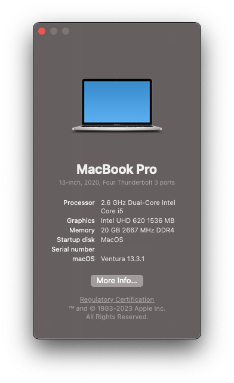
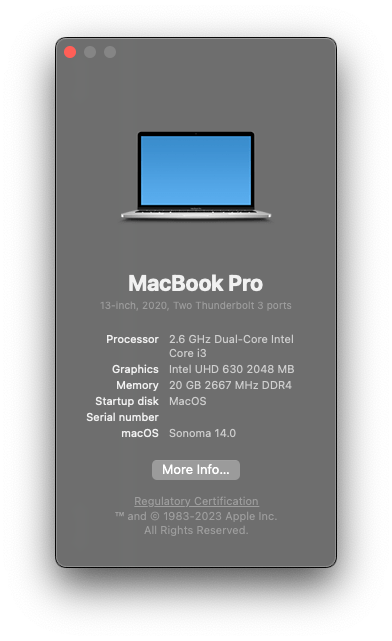

<!-- ALL-CONTRIBUTORS-BADGE:START - Do not remove or modify this section -->

<!-- ALL-CONTRIBUTORS-BADGE:END -->

# Lenovo-Ideapad-3-15IML05-Hackintosh

<!---

-->

Goal of this repo is to run Mac os on Lenovo IdeaPad 3 15IML05 Laptop.

|          macOS Ventura 13.3.1           |          macOS Ventura 14.0           |
| :-------------------------------------: | :-----------------------------------: |
|  |  |

## OpenCore Installation Guide

Go to [INSTALLATION_GUIDE_OPENCORE.md](INSTALLATION_GUIDE_OPENCORE.md)(**Detailed guide**)

## About this Laptop

### Original Hardware Info 💻

| Type         | Spec                                                            | Status      | Link                                                                         |
| :----------- | :-------------------------------------------------------------- | :---------- | :--------------------------------------------------------------------------- |
| Computer     | Lenovo IdeaPad 3 15IML05 U1                                     | Working     | -                                                                            |
| BIOS Version | LENOVO DXCN39WW (10/13/2021)                                    | Working     | -                                                                            |
| CPU          | DualCore Intel Core i3-10110U, 3700 MHz (37 x 100)              | Working     | -                                                                            |
| Chipset      | Intel Comet Point-LP, Intel Comet Lake-U                        | Working     | -                                                                            |
| Graphics     | Intel(R) UHD Graphics                                           | Working     | [Guide](https://github.com/acidanthera/WhateverGreen/tree/master/Manual)     |
| Audio        | Realtek ALC 230, Codec ID:10EC0230 / 17AA383A                   | Working     | [Guide](https://github.com/acidanthera/AppleALC/wiki/Installation-and-usage) |
| Ethernet     | Not Present                                                     | N/A         | -                                                                            |
| WiFi         | Intel(R) Wireless-AC 9560                                       | Not Working | -                                                                            |
| Bluetooth    | Intel(R) Wireless Bluetooth(R) - USB\VID_8087&PID_0AAA&REV_0002 | Working     | -                                                                            |
| Touchpad     | I2C ELAN0001 [PnP - MSFT0001]                                   | Working     | -                                                                            |
| Keyboard     | Standard PS/2 Keyboard                                          | Working     | -                                                                            |
| Webcam       | Integrated Camera - USB\VID_30C9&PID_001B&REV_0005&MI_00        | Working     | -                                                                            |
| Battery      | Sunwoda - L19D3PF5 - Rechargeable LiP - 46270 mWh               | Working     | -                                                                            |

### Modifications/Accessories 🔨

| Type                                                                                 | Spec | Status  |
| :----------------------------------------------------------------------------------- | :--- | :------ |
| Wireless Bluetooth Mouse Rechargeable Mouse                                          | -    | Working |
| G.Skill Ripjaws SO-DIMM 16GB (1 \* 16GB) DDR4 3200 CL22-22-22-52 1.20V Laptop Memory | -    | Working |

### Software Status 👨‍💻

| Type                            | Spec | Status                    |
| :------------------------------ | :--- | :------------------------ |
| Battery Status                  | -    | Working                   |
| Brightness With keys(F11 - F12) | -    | Working                   |
| Sleep                           | -    | Not Working               |
| Trackpad                        | -    | Laggy and High cpu usages |

### Kext Used

| Kext                                                                                       | Info                                                                                                                                                                                                                                                                                                       |
| :----------------------------------------------------------------------------------------- | :--------------------------------------------------------------------------------------------------------------------------------------------------------------------------------------------------------------------------------------------------------------------------------------------------------- |
| [Lilu.kext](https://github.com/acidanthera/Lilu)                                           | Arbitrary kext and process patching on macOS.                                                                                                                                                                                                                                                              |
| [VirtualSMC.kext](https://github.com/acidanthera/VirtualSMC)                               | SMC Emulator Layer.                                                                                                                                                                                                                                                                                        |
| [WhateverGreen.kext](https://github.com/acidanthera/WhateverGreen)                         | Various patches necessary for certain ATI/AMD/Intel/Nvidia GPUs. This is needed for Intel HD 520.                                                                                                                                                                                                          |
| [ECEnabler.kext](https://github.com/1Revenger1/ECEnabler) DISABLED                         | Allows reading Embedded Controller fields over 1 byte long, vastly reducing the amount of ACPI modification needed (if any) for working battery status.                                                                                                                                                    |
| [CpuTscSync.kext](https://github.com/acidanthera/CpuTscSync)                               | It is a Lilu plugin, combining functionality of VoodooTSCSync and disabling xcpm_urgency if TSC is not in sync. It should solve kernel panics after wake.                                                                                                                                                  |
| [AirportItlwm.kext](https://github.com/OpenIntelWireless/itlwm)                            | Intel Wi-Fi Drivers for macOS.                                                                                                                                                                                                                                                                             |
| [HoRNDIS.kext](https://github.com/jwise/HoRNDIS)                                           | Android USB tethering driver for Mac OS X                                                                                                                                                                                                                                                                  |
| [HWPEnabler.kext](https://github.com/goodwin/HWPEnable)                                    | HWP is a technology introduced in Skylake which lets the CPU select its own stepping speed without the usage of the CPU Multiplier. Additionally it trottles/boosts itself much faster, which improoves overall CPU performance. With enabled HWP you dont need to create SSDTs with CPU P-States anymore. |
| [RTCMemoryFixup.kext](https://github.com/acidanthera/RTCMemoryFixup)                       | open source kernel extension providing a way to emulate some offsets in your CMOS (RTC) memory                                                                                                                                                                                                             |
| [SMCBatteryManager.kext](https://github.com/acidanthera/VirtualSMC)                        | Battery Status Monitoring.                                                                                                                                                                                                                                                                                 |
| [SMCProcessor.kext](https://github.com/acidanthera/VirtualSMC)                             | Processor Temp Monitoring.                                                                                                                                                                                                                                                                                 |
| [SMCSuperIO.kext](https://github.com/acidanthera/VirtualSMC)                               | Fan Reading.                                                                                                                                                                                                                                                                                               |
| [BlueToolFixup.kext](https://github.com/acidanthera/BrcmPatchRAM)                          | Required for macOS 12 or newer, as in macOS 12 Apple has changed parts of the Bluetooth stack from kernel-space to user-space                                                                                                                                                                              |
| [IntelBluetoothFirmware.kext](https://github.com/OpenIntelWireless/IntelBluetoothFirmware) | Intel Bluetooth Drivers for macOS.                                                                                                                                                                                                                                                                         |
| [IntelBTPatcher.kext](https://github.com/zxystd/IntelBTPatcher)                            | A Lilu base patcher that fix Intel Bluetooth on Bigsur, Catalina, Mojave, High sierra etc, tested with Bigsur and Catalina all working good.                                                                                                                                                               |
| [RestrictEvents.kext](https://github.com/Mieze/RTL8111_driver_for_OS_X)                    | Lilu Kernel extension for blocking unwanted processes causing compatibility issues on different hardware and unlocking the support for certain features restricted to other hardware.                                                                                                                      |
| [NVMeFix.kext](https://github.com/acidanthera/NVMeFix)                                     | NVMeFix is a set of patches for the Apple NVMe storage driver, IONVMeFamily. Its goal is to improve compatibility with non-Apple SSDs.                                                                                                                                                                     |
| [FeatureUnlock.kext](https://github.com/acidanthera/FeatureUnlock)                         | Add Sidecar support to unsupported models                                                                                                                                                                                                                                                                  |
| [BrightnessKeys.kext](https://github.com/acidanthera/BrightnessKeys)                       | Handler for brightness keys without DSDT patches                                                                                                                                                                                                                                                           |
| [UTBMap.kext](https://github.com/USBToolBox/kext)                                          | Contains USB port mappings.                                                                                                                                                                                                                                                                                |
| [AppleALC.kext](https://github.com/acidanthera/AppleALC)                                   | For Audio.                                                                                                                                                                                                                                                                                                 |
| [VoodooI2C.kext](https://github.com/VoodooI2C/VoodooI2C)                                   | For I2C Touchpad.                                                                                                                                                                                                                                                                                          |
| [VoodooI2CHID.kext](https://github.com/VoodooI2C/VoodooI2C)                                | For ELAN Touchpad.                                                                                                                                                                                                                                                                                         |
| [VoodooPS2Controller.kext](https://github.com/RehabMan/OS-X-Voodoo-PS2-Controller)         | Contains updated Voodoo PS/2 Controller, improved Keyboard & Synaptics TouchPad.                                                                                                                                                                                                                           |
| [HibernationFixup.kext](https://github.com/acidanthera/HibernationFixup)                   | A Lilu plugin intended to fix hibernation compatibility issues.                                                                                                                                                                                                                                            |
| [YogaSMC.kext](https://github.com/zhen-zen/YogaSMC)                                        | ACPI driver for OEM hardware.                                                                                                                                                                                                                                                                              |

                                                                                                                                                                                                                                          |

### SSDT Used

| Kext                 | Info                                       | Refrence Link                                                                                                             |
| :------------------- | :----------------------------------------- | :------------------------------------------------------------------------------------------------------------------------ |
| SSDT-AWAC.aml        | Fixing System Clocks                       | [Link](https://dortania.github.io/Getting-Started-With-ACPI/Universal/awac.html)                                          |
| SSDT-EC.aml          | Fixing Embedded Controller                 | [Link](https://dortania.github.io/Getting-Started-With-ACPI/Universal/ec-fix.html)                                        |
| SSDT-ECRW.aml        | YogaSMC-ACPI driver for OEM hardware       | [Link](https://github.com/zhen-zen/YogaSMC)                                                                               |
| SSDT-YVPC.aml        | YogaSMC-ACPI driver for OEM hardware       | -                                                                                                                         |
| SSDT-PNLFCFL.aml.aml | Fixing Backlight                           | [Link](https://dortania.github.io/Getting-Started-With-ACPI/Laptops/backlight.html)                                       |
| SSDT-EC-USBX.aml     | Fixes EC and USB Power Supply              | [Link](https://dortania.github.io/Getting-Started-With-ACPI/Universal/ec-fix.html#fixing-embedded-controller-ssdt-ecusbx) |
| SSDT-RHUB.aml        | Fixing RHUB                                | [Link](https://dortania.github.io/Getting-Started-With-ACPI/Universal/rhub-methods/ssdttime.html)                         |
| SSDT-GPRW.aml        | GPRW/UPRW/LANC Instant Wake Patch          | [Link](https://dortania.github.io/OpenCore-Post-Install/usb/misc/instant-wake.html)                                       |
| SSDT-TPD0.aml        | Fixing Trackpads                           | [Link](https://voodooi2c.github.io/#GPIO%20Pinning/GPIO%20Pinning)                                                        |
| SSDT-HPET.aml        | Fixing IRQ Conflicts                       | [Link](https://dortania.github.io/Getting-Started-With-ACPI/Universal/irq.html)                                           |
| SSDT-XOSI.aml        | Fixing Trackpads                           | [Link](https://dortania.github.io/Getting-Started-With-ACPI/Laptops/trackpad.html)                                        |
| SSDT-MEM2.aml        | Adds MEM2 ACPI Device to IGPU              | -                                                                                                                         |
| SSDT-PLUG.aml        | Enables native CPU Power Management (XCPM) | [Link](https://dortania.github.io/Getting-Started-With-ACPI/Universal/plug.html)                                          |
| SSDT-SBUS.aml        | Adds missing MCHC Device                   | [Link](https://dortania.github.io/Getting-Started-With-ACPI/Universal/smbus.html)                                         |
| SSDT-RCSM.aml        | -                                          | -                                                                                                                         |
| SSDT-ALS0.aml        | Fixing SMBus support                       | [Link](https://github.com/Acidanthera/OpenCorePkg/blob/master/Docs/AcpiSamples/Source/SSDT-ALS0.dsl)                      |

### TODO

- Sleep issue
- Laggy touchpad and high cpu usages during use.
- Suggest to me via issue.

### Telegram Channel

- [India Hackintosh Community Group](https://t.me/indianhackintosh)
- [India Hackintosh Channel](https://t.me/hackintoshcommunity)

### Credits

- [Apple](https://www.apple.com) for macOS.
- [Acidanthera](https://github.com/acidanthera) for most of the kexts.
- [goodwin](https://github.com/goodwin) for ALCPlugFix.
- [RehabMan](https://github.com/RehabMan) for some patches.
- [Steve Zheng](https://github.com/stevezhengshiqi) for some patches.
- [Sniki](https://github.com/Sniki) for some patches.
- [daliansky](https://github.com/daliansky) for some patches.
- [Moh_Ameen](https://github.com/ameenjuz) for some patches.
- [OpenIntelWireless](https://github.com/OpenIntelWireless) for Intel WiFi drivers.
- And anyone else that helped to develop and improve hackintoshing.
